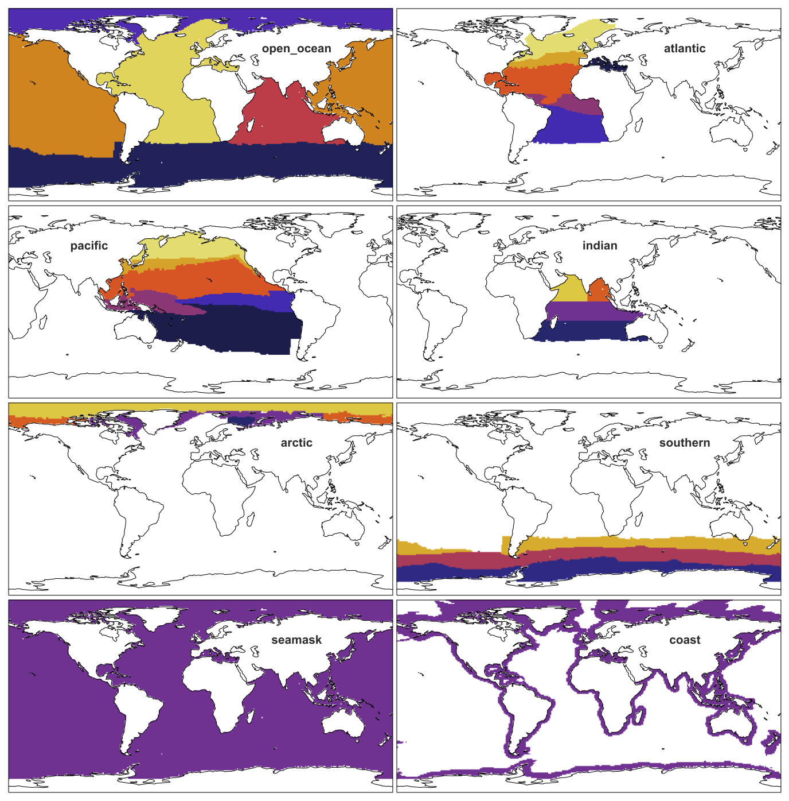

# RECCAP2-ocean regions 

We have used the biomes of Fay and McKinley to divide the basins into subregions. 
The areas where FM14 does not have data have been ingested by the neighboring biome or a new distinct biome has been added. 
Stray and missplaced pixels have been ingested into the surrounding biomes. 
The figure below shows the masks for the file [RECCAP2_region_masks_all_v20220620.nc](https://github.com/RECCAP2-ocean/shared-resources/blob/master/regions/RECCAP2_region_masks_all_v20220620.nc). 
Region names are stored as the attribute `region_names` for each variable in the netCDF file. The names are based on the Fay and McKinley biomes. 
The code used to create the mask is in [/regions/scripts/reccap2ocean_regions.py](https://github.com/RECCAP2-ocean/shared-resources/blob/62e836e2f1231b601b80b2b99bb7f1cc3b02374c/regions/scripts/reccap2ocean_regions.py)

## Coastal ocean

For the coastal ocean, we could use the MARCATs coastal regions as a mask (Laurelle et al. 2013). The map below was made from the shapefile and converted to a binned 1° map. 

Note that this has not been discussed and is only a suggestion! Further topics for discussion include how coastal ocean will be integrated with open ocean flux estimates. 

## How the global map was created
Below is a map of the proposed regions for RECCAP v2. Note that the coastal boundaries have not been added to this map. 

The map is annotated to show how boundaries were decided. WOA09 uses the [World Ocean Atlas 09 basins map](https://iridl.ldeo.columbia.edu/SOURCES/.NOAA/.NODC/.WOA09/.Masks/.basin/data.nc). FM14 indicates Fay and McKinley (2014) boundaries were used. 

